# Smart Door Lock
I made this application as my college project. 

Purpose of making this application was to access the door without touching it. 
As it is a security based application I have used OTP authentication using google Firebase. I have used bluetooth libraries of flutter for connection with Arduino Motor which is connected with HC -05 bluetooth module further connected with servo motor. So application sends the signals to open the door or lock the door. 

I am also saving the data of each user who is accessing the door by specific time and date, locally in the phone.

         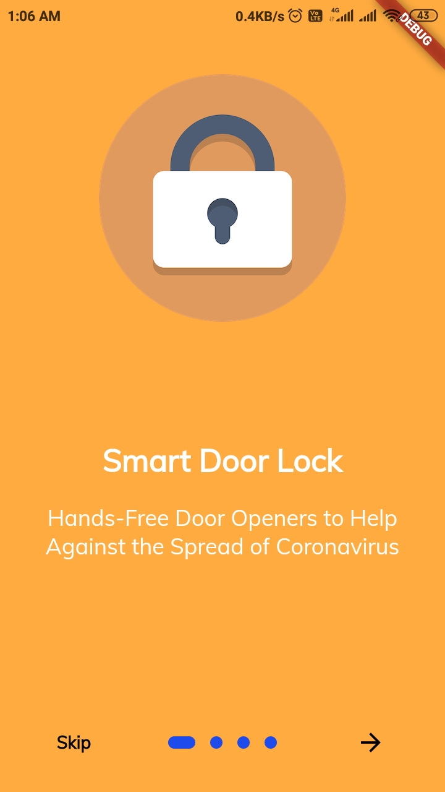         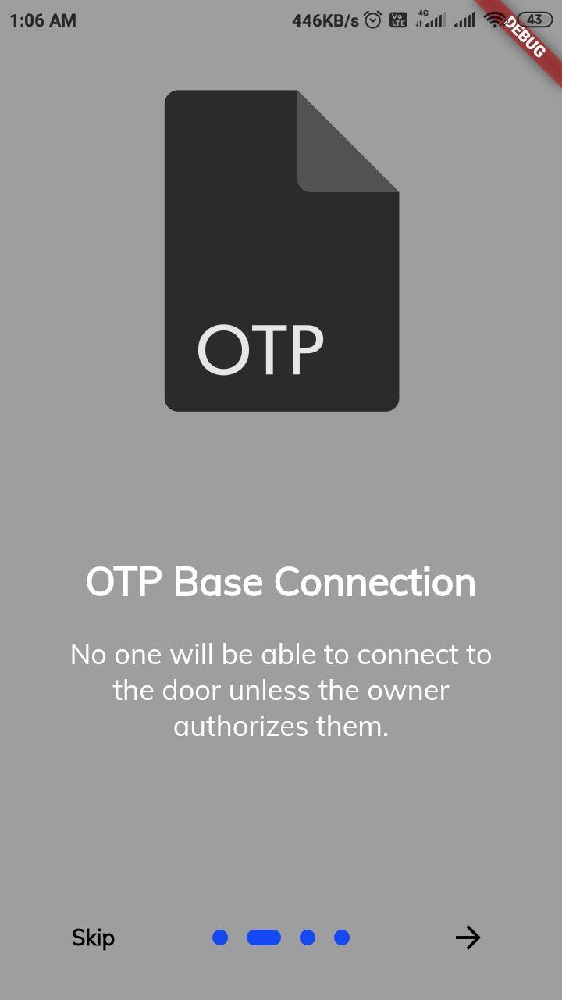

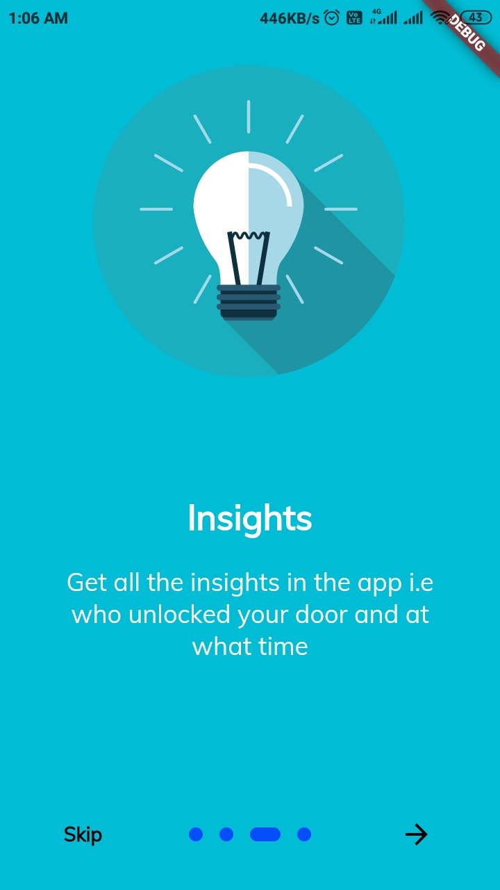         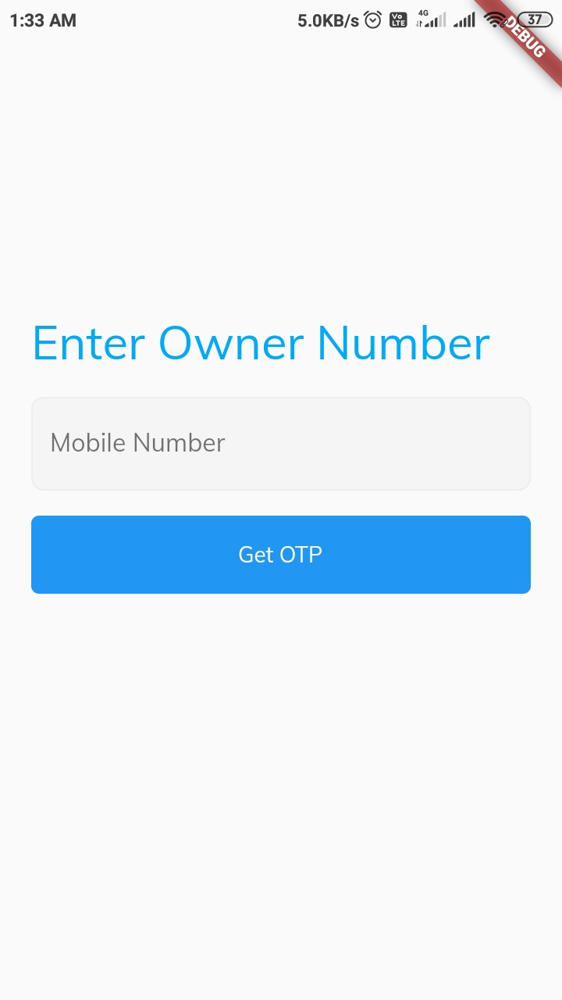         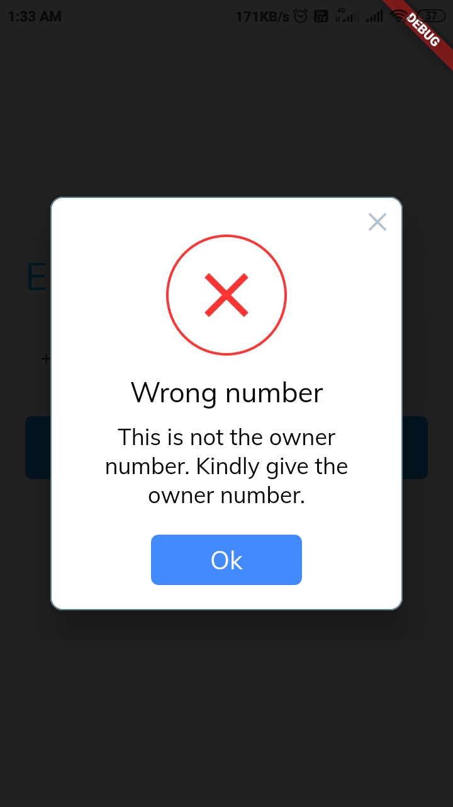

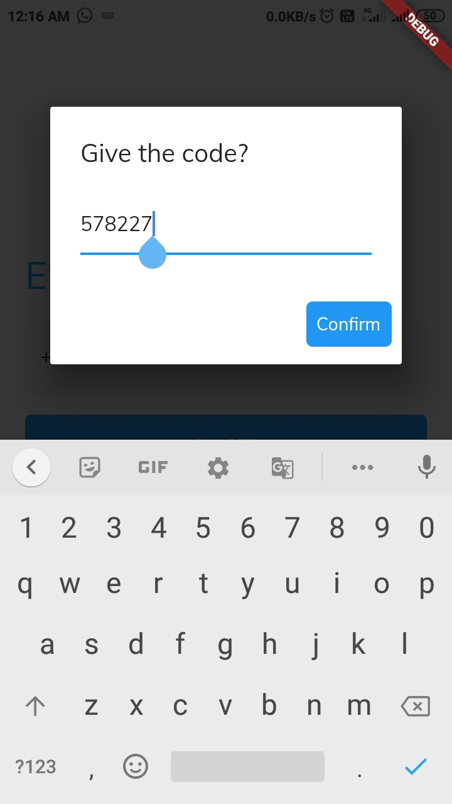         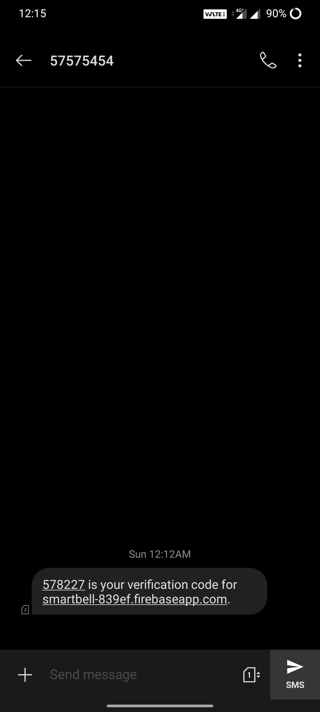         

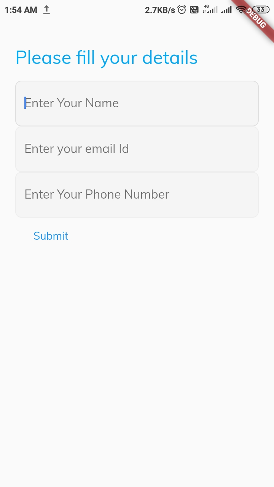         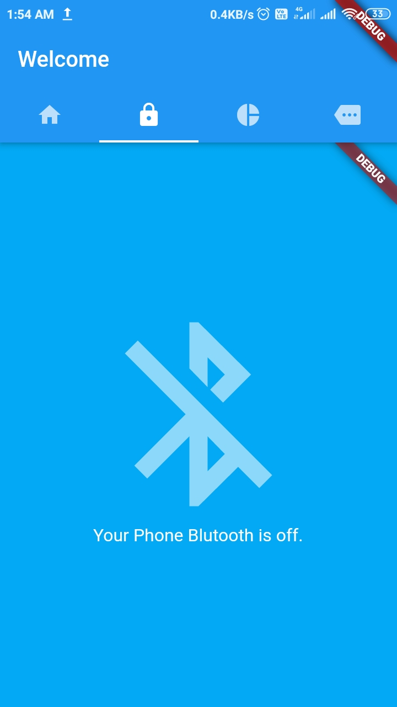         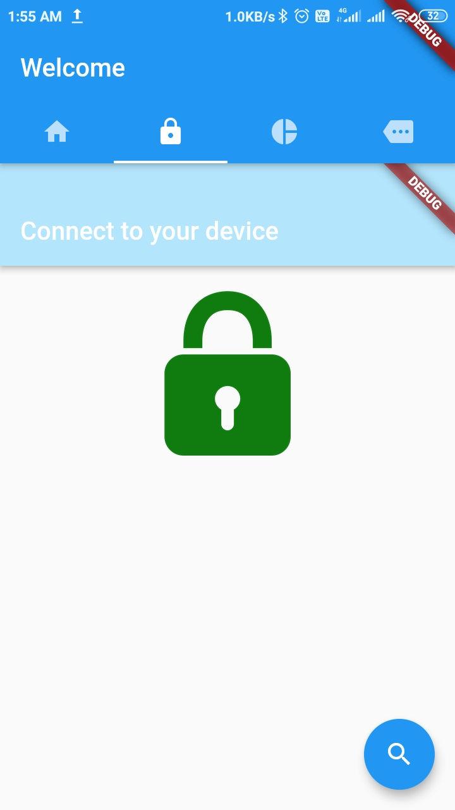

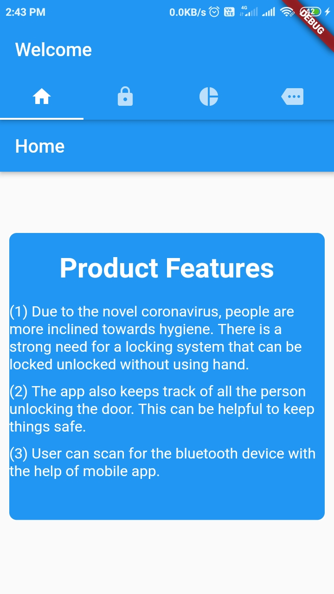         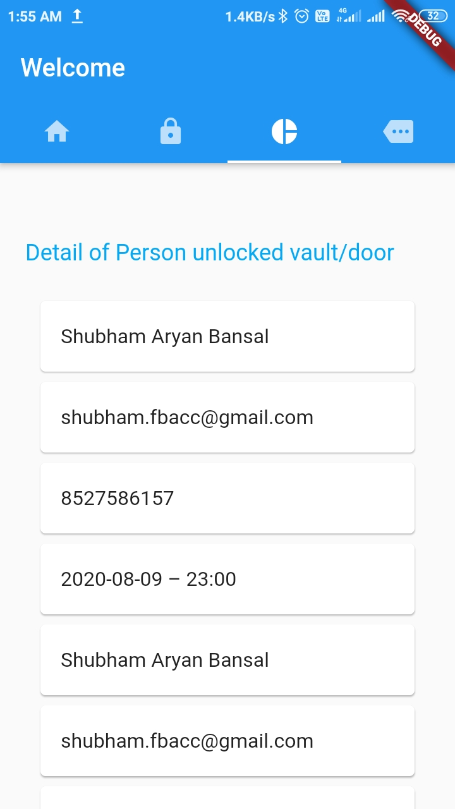         

